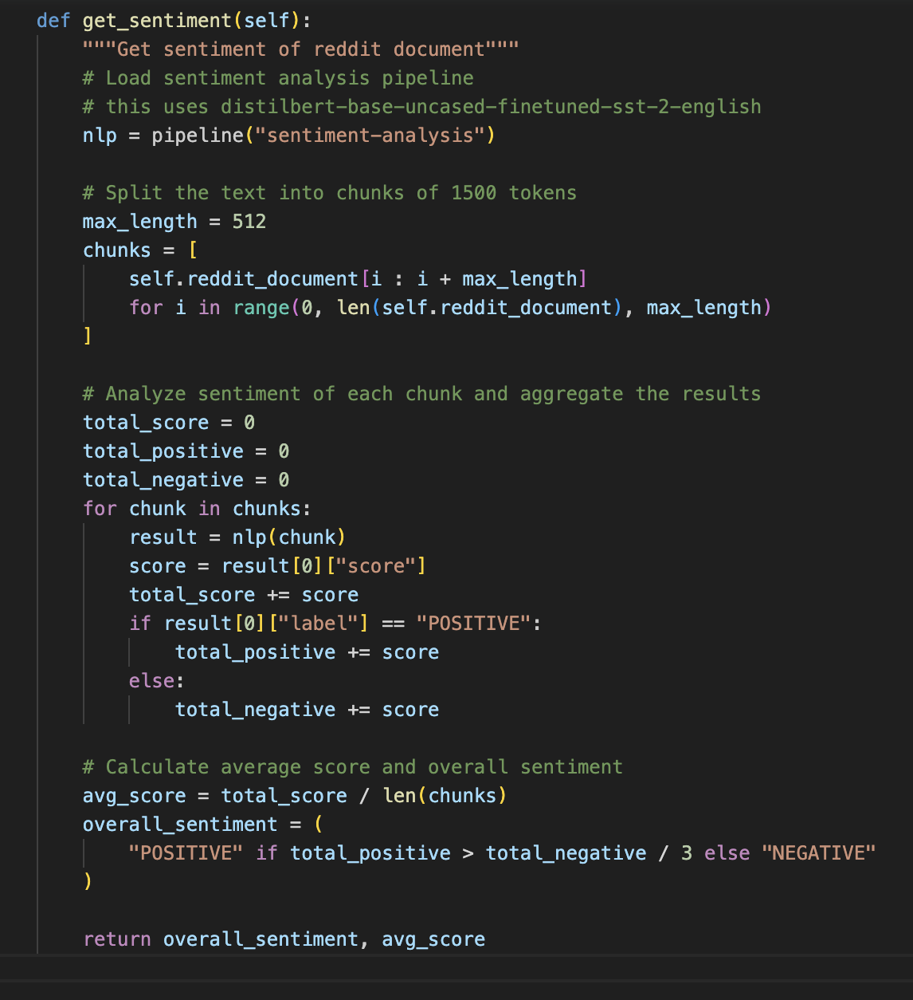
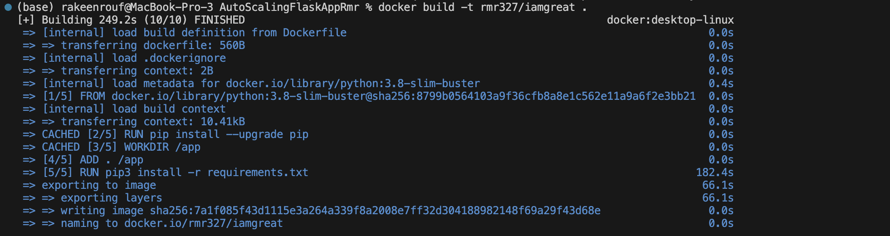
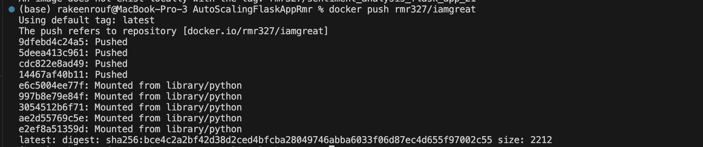
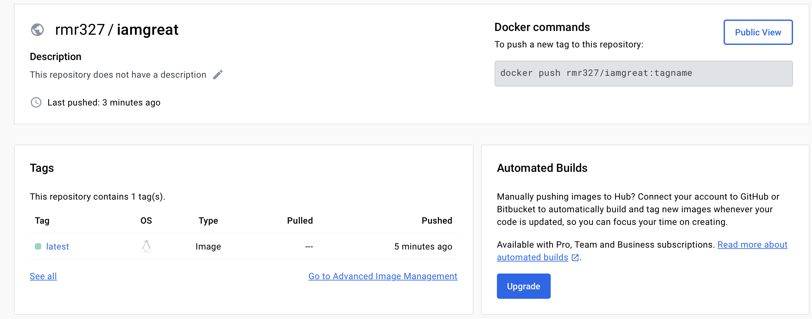
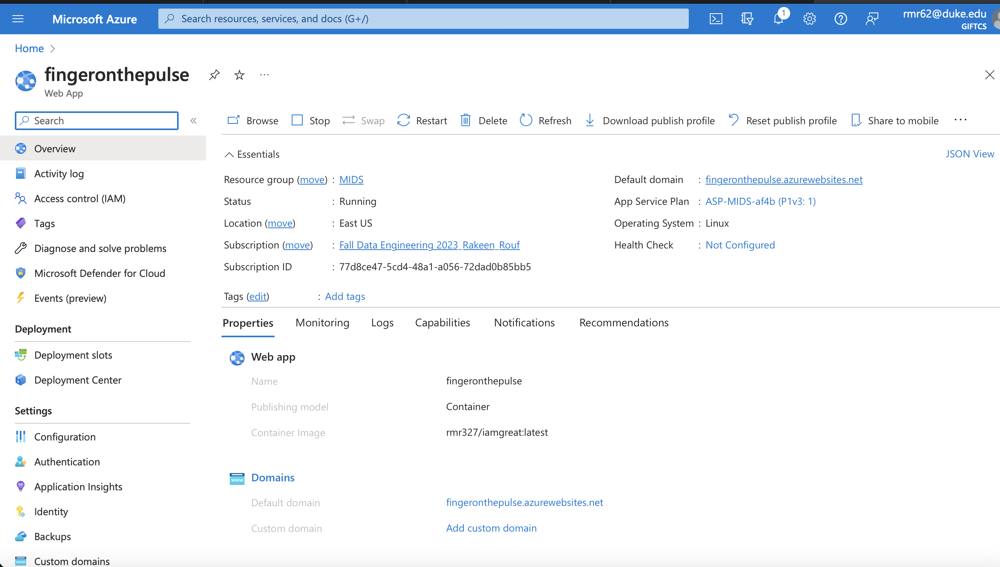
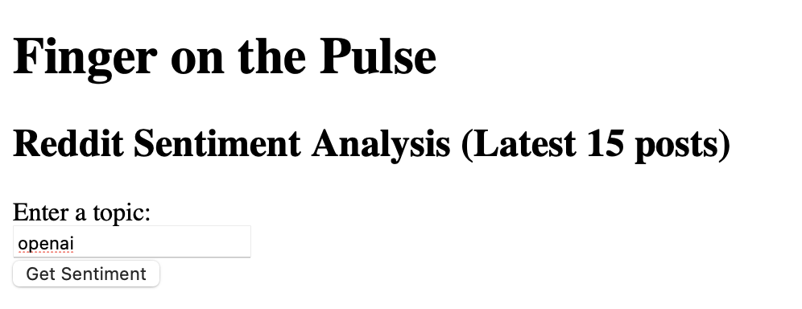
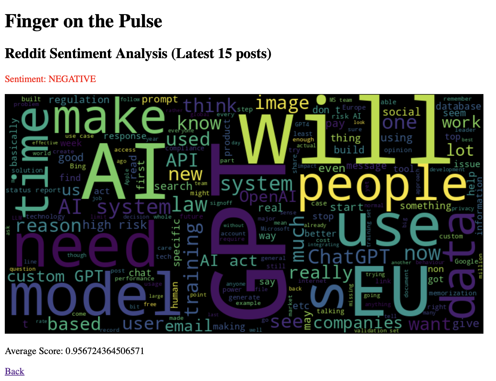
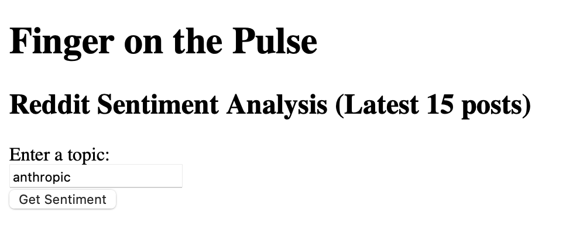
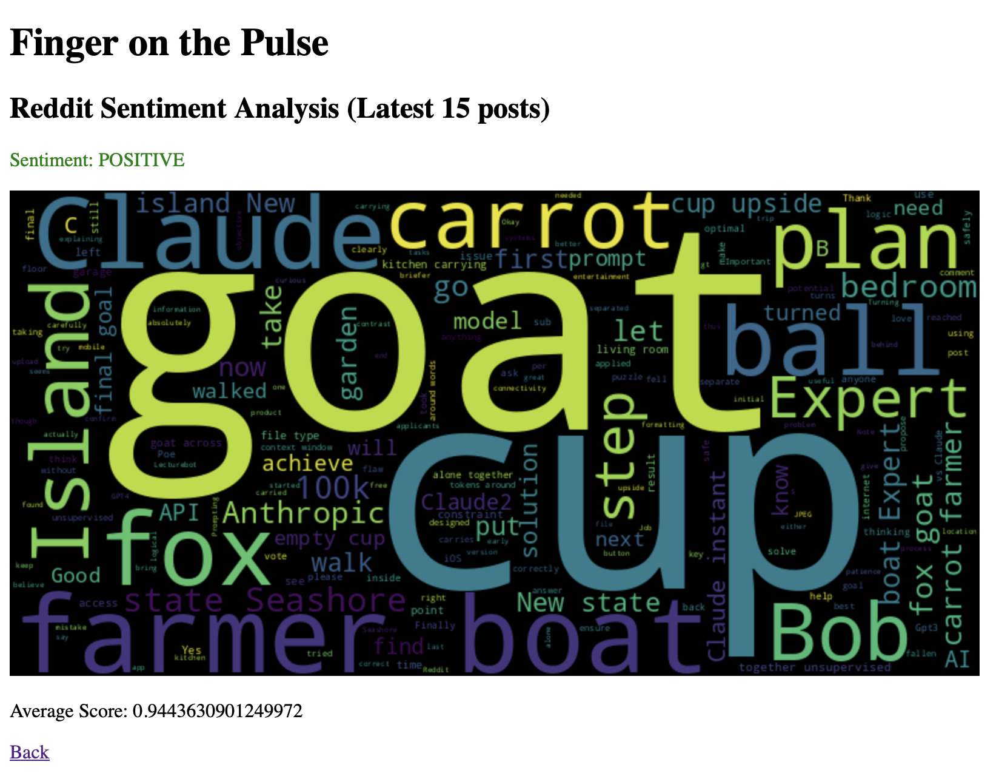

# Latest Sentiment Analysis on any Topic: Flask App
### by Rakeen Rouf

[](https://github.com/nogibjj/AutoScalingFlaskAppRmr/actions/workflows/python_ci_cd.yml)

**Walk Through Youtube Video**
[Youtube](https://youtu.be/6mLuqUGn5n8)

---
This repository contains a Flask web application that performs sentiment analysis on the latest posts from a user defined topic's subreddit using the Reddit API and the Hugging Face Transformers library.

## Features

- Retrieves the latest posts from a specified topic's subreddit using the Reddit API.
- Performs sentiment analysis on the retrieved posts using the Hugging Face Transformers library.
- Displays the sentiment analysis results in a user-friendly web interface.
- Generates a word cloud visualization based on the retrieved posts.

## Usage of Large Language Model (LLM) for Sentiment Analysis

The reddit_sentiment_flask.py file in this repository utilizes a powerful large language model (LLM) for sentiment analysis. The LLM used in this code is distilbert-base-uncased-finetuned-sst-2-english, which has been pre-trained on a vast amount of text data.

The sentiment analysis functionality is implemented using the Hugging Face Transformers library, which provides an easy-to-use interface for working with LLMs. The sentiment analysis pipeline is created using the pipeline function from the library.



By leveraging the capabilities of the LLM, this code enables accurate sentiment analysis of the Reddit document. The LLM has been trained on a large corpus of text data, allowing it to capture complex language patterns and provide meaningful sentiment analysis results.


## Installation

1. Clone the repository:

   ```shell
   git clone https://github.com/your-username/repo-name.git
   ```

2. Install the required dependencies:

   ```shell
   pip install -r requirements.txt
   ```


## Usage

1. Run the Flask application:

   ```shell
   python reddit_sentiment_flask.py
   ```

2. Open your web browser and navigate to the locally hosted application.

3. Enter the name of the topic you want to analyze and click the "Get Sentiment Analysis" button.

4. The application will retrieve the latest posts from the specified topic's subreddit, perform sentiment analysis on them, and display the results along with a word cloud visualization.

## Dockerization and Hosting

This application has been Dockerized for easy deployment and scalability. The Docker image for this application has been uploaded to Docker Hub and hosted using Azure Container Registry.

The following steps where followed:

1. Build docker image (after loggin in to docket - docker login)


2. Push the docker image from step 1 to dockerhub




3. Add the image to Azure Container Registry


## Sample Usage for actionable and data driven recommendation

1. Positive Sentiment Example.

As we can see, as of Dec 10 5:05 pm, the public has a NEGATIVE sentiment on OpenAi. This makes sense, since they are known to be an unethical company. Avoid having long exposure.





1. Positive Sentiment Example.

As we can see, as of Dec 10 5:05 pm, the public has a POSITIVE sentiment on Anthropic. This makes sense, since they are known to be an ethical counter party to OpenAi. Avoid having long exposure.




